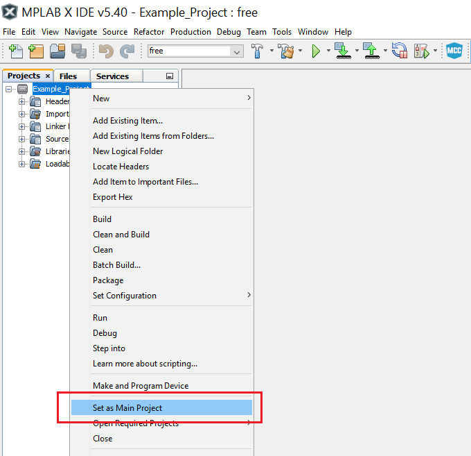

 # ADC Free Running

This example uses uses the Analog-to-Digital Converter (ADC) in Free Running mode. When configuring the ADC in Free Running mode, the next conversion starts automatically after the previous one is completed. The ADC input pin needs to have the digital input buffer and the pull-up resistor disabled in order to have the highest possible input impedance.

## Related Documentation

More details and code examples on the AVR128DA48 can be found at the following links:
- [TB3209-Getting Started with Analog-to-Digital Converter (ADC)](http://ww1.microchip.com/downloads/en/Appnotes/TB3209-Getting-Started-with-ADC-DS90003209.pdf)
- [AVR128DA48 Product Page](https://www.microchip.com/wwwproducts/en/AVR128DA48)
- [AVR128DA48 Code Examples on GitHub](https://github.com/microchip-pic-avr-examples?q=avr128da48)
- [AVR128DA48 Project Examples in START](https://start.atmel.com/#examples/AVR128DA48CuriosityNano)

## Software Used

- MPLAB® X IDE 5.40 or newer [(microchip.com/mplab/mplab-x-ide)](http://www.microchip.com/mplab/mplab-x-ide)
- MPLAB® XC8 2.30 or a newer compiler [(microchip.com/mplab/compilers)](http://www.microchip.com/mplab/compilers)
- MPLAB® Code Configurator (MCC) 4.0.1 or newer [(microchip.com/mplab/mplab-code-configurator)](https://www.microchip.com/mplab/mplab-code-configurator)
- MPLAB® Code Configurator (MCC) Device Libraries 8-bit AVR® MCUs 2.5.0 or newer [(microchip.com/mplab/mplab-code-configurator)](https://www.microchip.com/mplab/mplab-code-configurator)
- AVR-Dx 1.4.75 or newer Device Pack

## Hardware Used

- AVR128DA48 Curiosity Nano [(DM164151)](https://www.microchip.com/Developmenttools/ProductDetails/DM164151)

## Setup
The AVR128DA48 Curiosity Nano Development Board is used as test platform.

 

The following configurations must be made for this project:

- Set the main clock to 4 MHz
- Configure ADC in Free Running mode with 10-bit resolution. Choose peripheral clock divided by 4 as clock source and PD6 as input channel 
- Configure VREF to use the VDD as voltage reference for ADC and enable the ALWAYS ON featured
- Disable the digital input buffer and the pull-up resistor for pin PD6

 |Pin                       | Configuration      |
 | :---------------------:  | :----------------: |
 |            PD6           |   Analog input     |

 ## Operation
 1. Connect the board to the PC.

 2. Open the Free_Running.X project in MPLAB X IDE.

 3. Set the Free_Running.X project as main project. Right click on the project in the **Projects** tab and click **Set as Main Project**.

 

 4. Clean and build the Free_Running.X project. Right click on the **Free_Running.X** project and select **Clean and Build**.

 

 5. Select the **AVR128DA48 Curiosity Nano** in the Connected Hardware Tool section of the project settings:
   - Right click on the project and click **Properties**
   - Click on the arrow right next to Connected Hardware Tool
   - Select the **AVR128DA48 Curiosity Nano** (click on the **SN**), click **Apply** and then click **OK**:

 

 6. Program the project to the board. Right click on the project and click **Make and Program Device**.

 

## Summary

This project shows how to configure the ADC peripheral in Free Running mode where a new conversion starts automatically after the previous one is completed.
